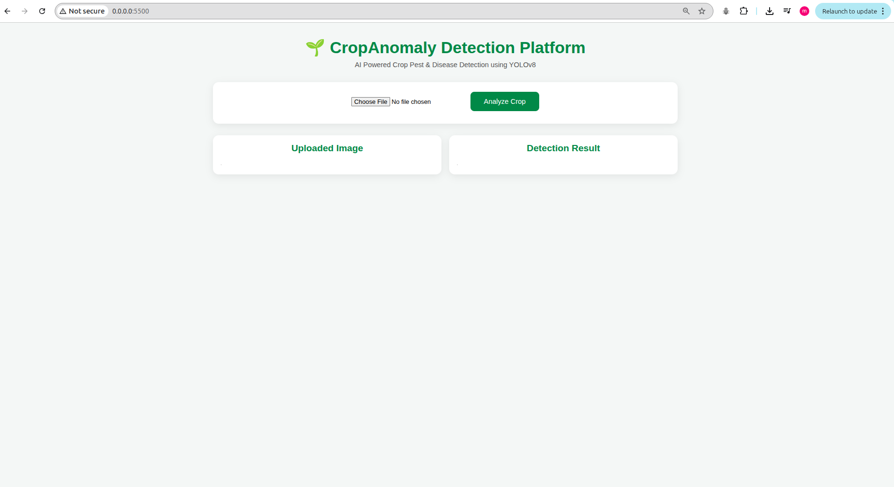
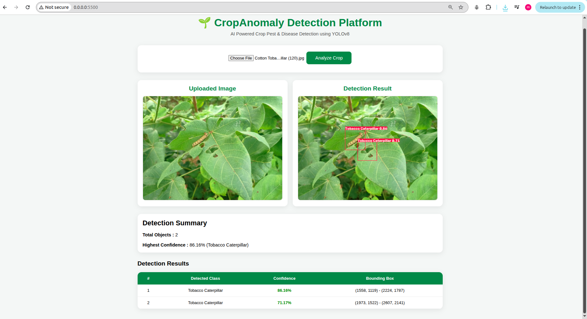

# 🌱 CropAnomaly Detection Platform

An AI-powered crop monitoring platform that detects crop pests and diseases from leaf images using a custom-trained YOLOv8 object detection model.

The project provides a complete end-to-end workflow including:

- Dataset preparation
- YOLOv8 model training
- FastAPI backend
- Interactive web frontend
- Real-time pest detection
- Bounding box visualization
- Confidence scoring

---

# Features

- Detect crop pests from uploaded images
- Real-time inference using YOLOv8
- FastAPI REST API
- Interactive frontend
- Bounding box visualization
- Confidence score for every detection
- Complete model training pipeline included

---

# Tech Stack

## AI / ML

- YOLOv8
- OpenCV
- NumPy
- Pandas

## Backend

- Python
- FastAPI

## Frontend

- HTML
- CSS
- JavaScript

## Training

- Ultralytics
- COCO annotations
- Kaggle

---

# Project Structure

```text
CropAnomaly-Detection-Platform
│
├── backend
├── frontend
├── model_training
├── assets
└── README.md
```

---

# Screenshots

## Home



---

## Detection Result



---

# Model Training

The project includes the complete model training workflow.

Steps include

- Dataset preparation
- COCO to YOLO conversion
- Train/Validation split
- Data augmentation
- YOLOv8 training
- Model evaluation
- Best model export

Training code is available inside

```

model_training/

```

---

# Running the Project

## Clone Repository

```bash
git clone https://github.com/<username>/CropAnomaly-Detection-Platform.git
```

```
cd CropAnomaly-Detection-Platform
```

---

## Backend

```
cd backend
```

Install dependencies

```
pip install -r requirements.txt
```

Run server

```
uvicorn app:app --reload
```

Backend runs at

```
http://127.0.0.1:8000
```

---

## Frontend

Open

```
frontend/index.html
```

using Live Server.

---

# API

## POST

```
/predict
```

Input

```
multipart/form-data
```

Parameter

```
file
```

Response

```json
{
  "success": true,
  "detections": [
    {
      "class": "Leaf Hopper",
      "confidence": 93.5,
      "x1": 10,
      "y1": 15,
      "x2": 90,
      "y2": 120
    }
  ]
}
```

---

# Future Improvements

- Mobile application
- Cloud deployment
- Disease treatment recommendation
- Severity estimation
- Multi-crop support
- Grad-CAM explainability
- User authentication
- Detection history
- GPS-enabled farm mapping

---

# Author

**L S V Sandeep M**

Backend Engineer | AI Engineer | Data Scientist

LinkedIn:
https://linkedin.com/in/lsv-sandeep-margana

GitHub:
https://github.com/sandeepmargana
